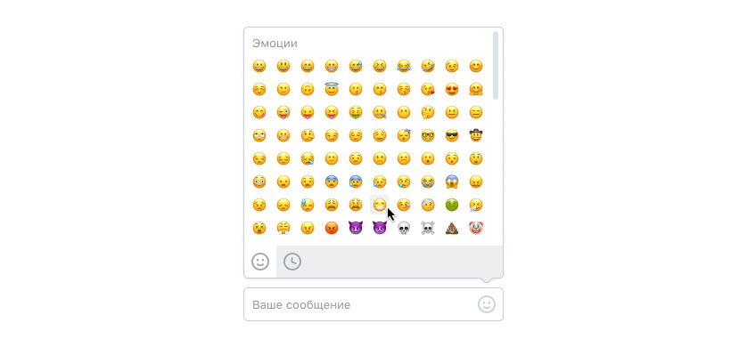

# VKontakte - Intern in the team Web messenger

**Вы также можете прочитать этот README на [русском](https://github.com/klekwedge/vk-test-2021/blob/main/README.md)**

## Table of contents

- [Deployment instructions](#deployment-instructions)
- [Overview](#overview)
  - [Screenshot](#screenshot)
  - [Links](#links)
- [My process](#my-process)
  - [Built with](#built-with)
  - [What I learned](#what-i-learned)
- [Author](#author)

## Deployment instructions

**To run the project, you need to have [npm](https://nodejs.org/en/) and [git](https://git-scm.com/downloads) installed on your computer**

1. Make a clone of this repository ```git clone https://github.com/klekwedge/vk-test-2021.git```
2. Install all required npm packages with ```npm i```
3. Run the project with the command ```npm run dev```

## Overview

### Exercise


We need to develop an input field with an interface for adding emoji.

- The input field should resize to fit the entered text.
- When you click on the icon on the right, a drop-down emoji selection interface should open.
- In the emoji selection interface, there are 2 icons at the bottom. They switch the view mode between the entire list and recently used emojis (you can remember, for example, the last 25 used).

### Additional task


You can do an additional task: find and highlight menus, hashtags, links and email addresses in the input field.

### Screenshot


### Links

- [Solution URL](https://github.com/klekwedge/vk-test-2021)
- [Live Site URL](https://klekwedge-vk-test-2021.vercel.app/)

## My process

### Built with

- React
- TypeScript
- SCSS
- Vite

### What I learned

## Author

- [Website](https://klekwedge-cv.vercel.app/)
- [Linkedin](https://www.linkedin.com/in/klekwedge/)
- [Facebook](https://www.facebook.com/klekwedge)

