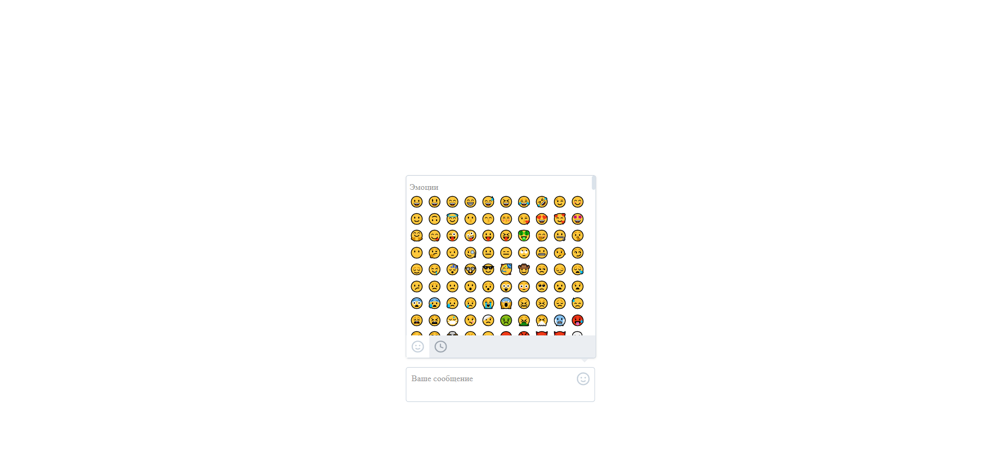

# VKontakte - Intern in the team Web messenger

**You can also read this README in [English](https://github.com/klekwedge/snake/blob/main/README.EN.md).**

## Оглавление

- [Инструкции по развертыванию](#инструкции-по-развертыванию)
- [Обзор](#обзор)
  - [Скриншот](#скриншот)
  - [Ссылки](#ссылки)
- [Мой процесс](#мой-процесс)
  - [Стек](#стек)
  - [Что я узнал](#что-я-узнал)
- [Автор](#автор)

## Инструкции по развертыванию

**Для запуска проекта на вашем компьютере должны быть установлены [npm](https://nodejs.org/en/) и [git](https://git-scm.com/downloads)**

1. Сделайте клон этого репозитория ```git clone https://github.com/klekwedge/snake.git```
2. Установите все необходимые пакеты npm с помощью ```npm i```
3. Запустите проект командой ```npm run dev```

## Обзор

### Задание


Нужно разработать поле ввода с интерфейсом для добавления эмоджи.

- Поле ввода должно изменять размер под введённый текст.
- При нажатии на иконку справа должен открываться выпадающий интерфейс выбора эмоджи.
- В интерфейсе выбора эмоджи внизу есть 2 иконки. Они переключают режим просмотра между всем списком и недавно использованными эмоджи (можно запоминать, например, последние 25 использованных).

### Дополнительное задание


Можно сделать дополнительное задание: находить и подсвечивать в поле ввода меншены, хештеги, ссылки и адреса электронной почты.

### Скриншот


### Ссылки

- [Ссылка на проект](https://github.com/klekwedge/snake)
- [Деплой](https://klekwedge-snake.vercel.app/)

## Мой процесс

### Стек

- React
- TypeScript
- SCSS
- Vite

### Что я узнал

Я научился создавать логику игры-змейки, понял, как лучше переключаться между компонентами, улучшил свои навыки типизации и работы с состоянием.

## Автор

- [Вебсайт](https://klekwedge-cv.vercel.app/)
- [Linkedin](https://www.linkedin.com/in/klekwedge/)
- [Facebook](https://www.facebook.com/klekwedge)
